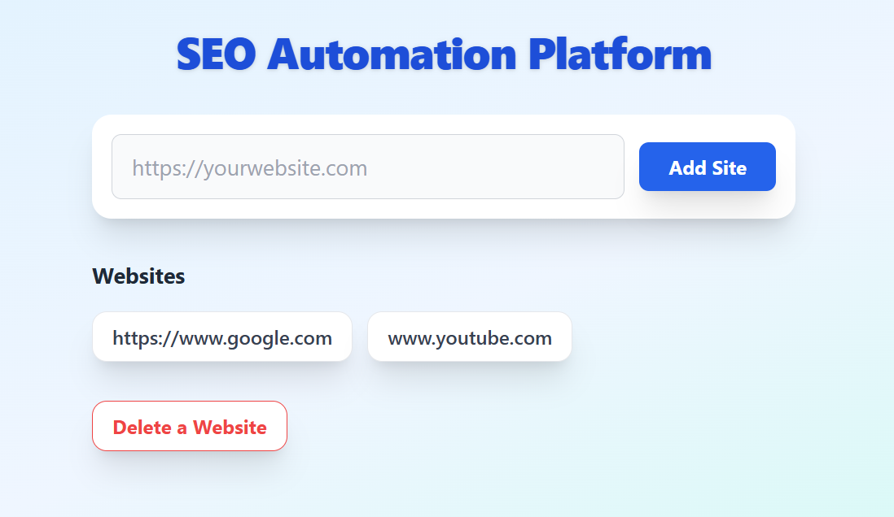
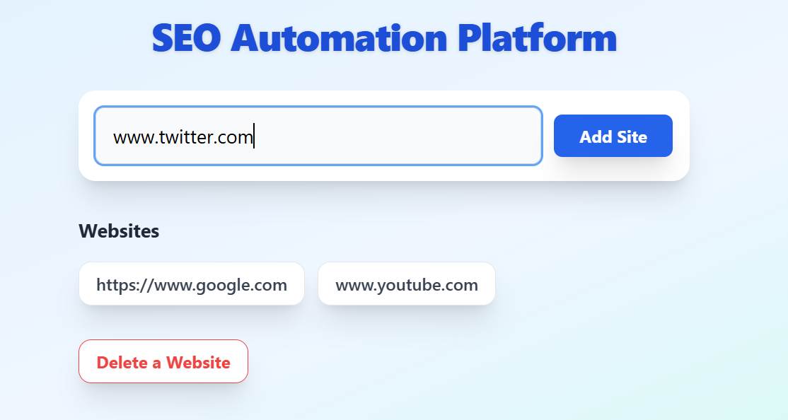
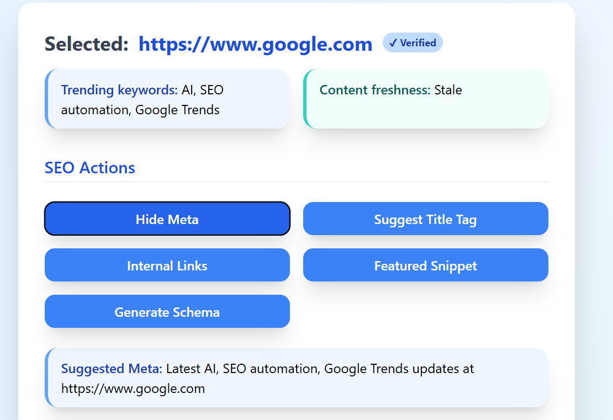
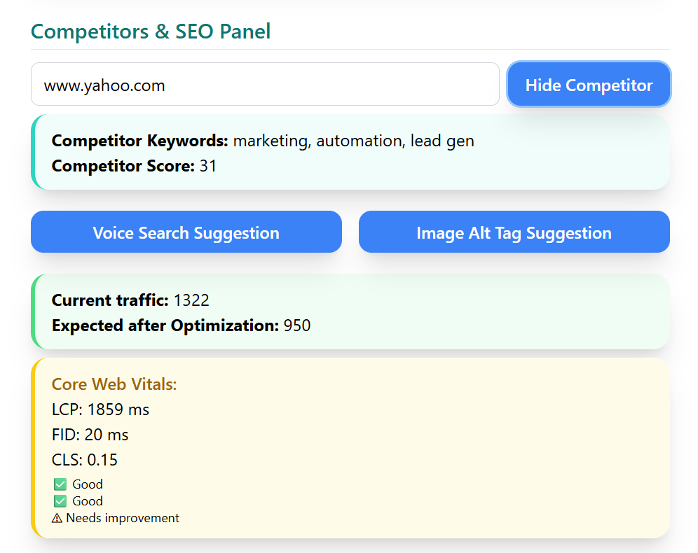
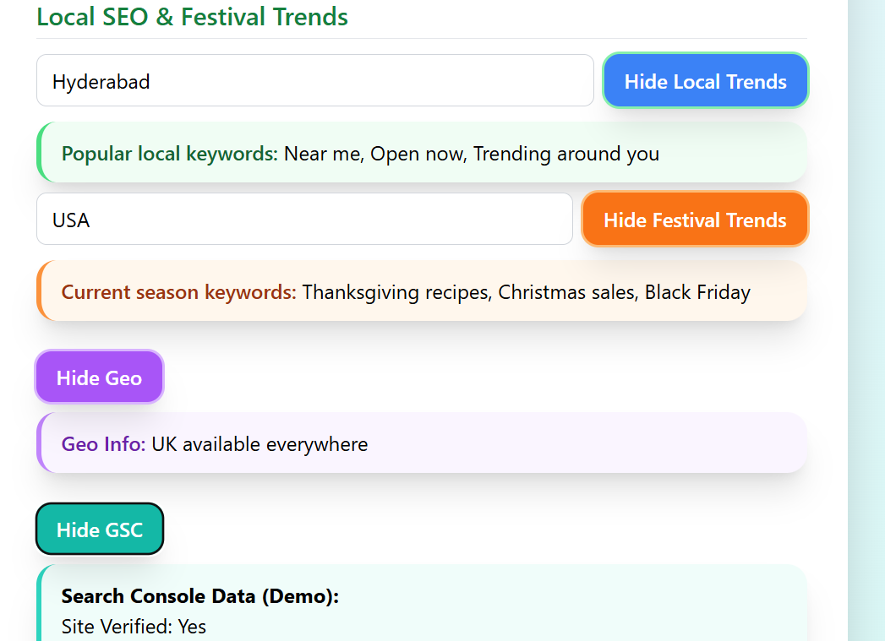
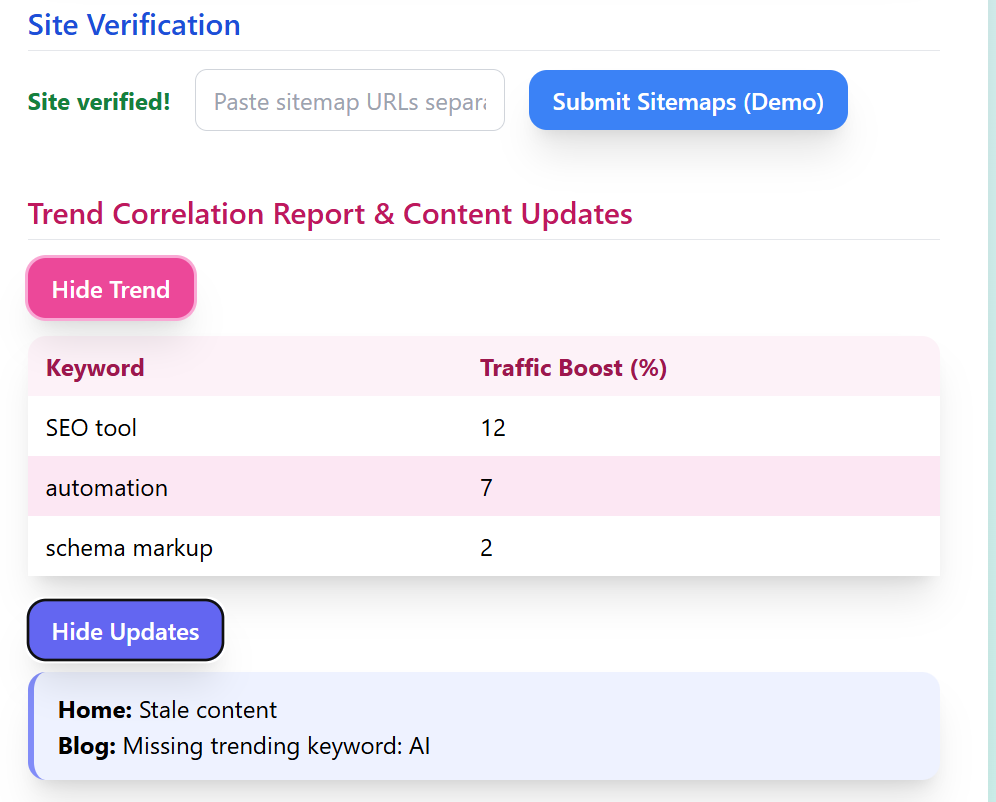
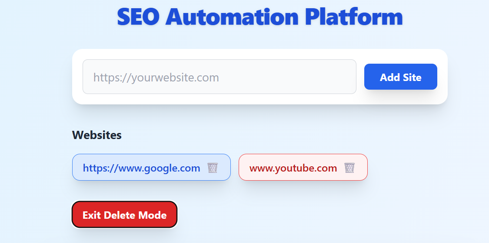

# SEO Automation Platform (MERN + TailwindCSS)

Welcome to **SEO Automation Platform**, an all-in-one solution for SEO analytics and automation built using **MongoDB, Express, React, and Node.js**, with a beautiful dashboard powered by **Tailwind CSS**.  
If you’re a hiring manager or tech enthusiast, this platform demonstrates advanced full-stack engineering, modern frontend design, and clean RESTful/backend integration.

---

## 📋 About the Project

SEO Automation Platform enables users to manage multiple websites and run automated SEO analyses with a single, intuitive interface.  
You can add sites, view toggleable SEO recommendations per site, and access trend, competitor, and performance modules — all backed by secure, persistent storage.

---

## 🚀 Core Features

- **Add, select, and delete multiple websites** (MongoDB-backed with soft delete mode for safety)
- **Instant SEO recommendations** (Meta/tag/links/snippet/schema suggestions via demo endpoints)
- **Competitor and trend tracking** (mocked competitor score/trend reporting)
- **Google Search Console, sitemap, and site verification panel** (demo/mock endpoints)
- **Performance monitoring & Core Web Vitals** (mocked insights per site)
- **Voice and image search optimization**
- **Local/festival trends analysis**
- **Toggle all SEO actions and outputs for a clean workflow**
- **Professional, responsive dashboard UI (TailwindCSS, mobile supported)**
- **Workflow ready for extension with real APIs**

---

## 🖼️ Screenshots

  
  
  
  
  
  
  

---

## 🛠️ Tech Stack

- **Frontend:** React, TailwindCSS, Axios
- **Backend:** Node.js, Express.js, Mongoose
- **Database:** MongoDB (Atlas for cloud, or local)
- **Tooling:** VS Code, Git & GitHub

---

## 👩‍💻 How It Works

- **Add Website**: Enter a URL and instantly see it added to your dashboard.
- **Select/Unselect Website**: Click a website to view all automation controls. Click it again to hide.
- **Delete Mode**: Activate “Delete a website” mode, then safely delete by clicking any site (Accidental delete almost impossible).
- **Actions Panel**: Suggest meta/title/links, analyze competitors, check GSC/demo data, run performance and trend modules.
- **Toggle Outputs**: Show/hide outputs for clear comparison.
- **Mobile-Ready**: Completely responsive UI.

---

## 📅 Future Enhancements

- **Production-ready API endpoints** (plug into real SEO, GSC, and trend data)
- **Export/Reports (PDF/CSV)**
- **User authentication & roles**
- **Charts for SEO growth visualization**
- **(OPTIONAL) Dark mode toggle**

---

## 📣 Contact

Open to work and collaborations!  
📧 [saicharanchilla7777@gmail.com](mailto:saicharanchilla7777@gmail.com)  
🔗 [LinkedIn](https://www.linkedin.com/in/saicharan-chilla-2b2201271/)  
💻 [GitHub](https://github.com/228w1a1278)

---

